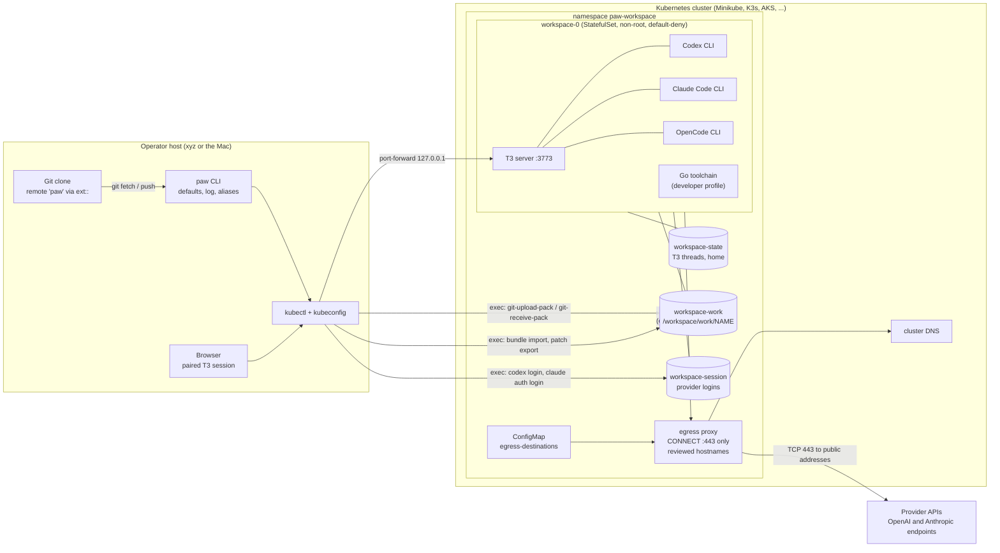
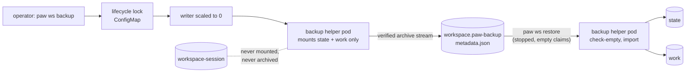
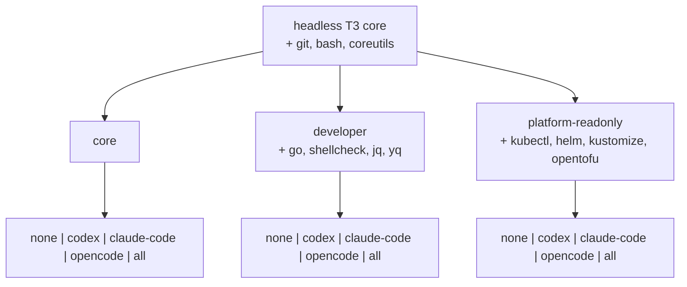

# Architecture at a glance

One PAW workspace on one Kubernetes cluster, as deployed today by the
Minikube and generic Kubernetes adapters. The decisions behind each box are
in the [ADR index](adr/README.md).

## Workspace topology

What the picture enforces:

- The workspace pod can reach exactly one thing, the proxy, and the proxy
  admits exactly the hostnames resolved from the selected provider's
  purposes ([ADR-013](adr/ADR-013-per-workspace-bounded-egress-proxy.md)):
  `auth.openai.com`, `chatgpt.com`, and `api.openai.com` for Codex;
  `claude.ai`, `platform.claude.com`, and `api.anthropic.com` for Claude
  Code. There is no DNS egress from the pod.
- Provider logins happen inside the pod and live on their own retained claim,
  outside every backup ([ADR-014](adr/ADR-014-pod-scoped-provider-login-state.md),
  [ADR-017](adr/ADR-017-retained-provider-session-claim.md)).
- Every transfer with the host rides `kubectl exec` under the operator's
  identity: bundle import, patch export, and the Git `ext::` transport
  ([ADR-004](adr/ADR-004-streamed-git-bundle-repository-materialization.md),
  [ADR-018](adr/ADR-018-host-driven-git-transport.md)). The workspace holds
  no remote and no credential of the operator's.
- The browser reaches T3 only through the loopback tunnel today; real ingress
  is future work.

## Backup and restore

The session claim is deliberately absent from both directions
([ADR-012](adr/ADR-012-offline-backup-and-empty-target-restore.md),
[ADR-017](adr/ADR-017-retained-provider-session-claim.md)).

## Image matrix

Fifteen workspace images, each with measured closure, layer, and transfer
budgets, plus the egress proxy and backup helper images
([ADR-015](adr/ADR-015-developer-profile.md),
[ADR-016](adr/ADR-016-all-providers-composition.md)).
